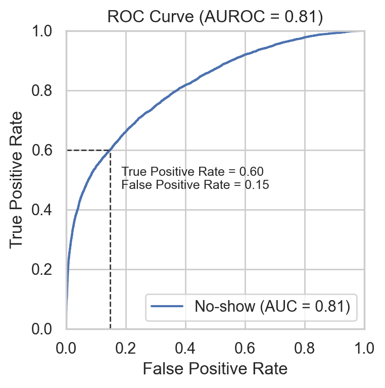
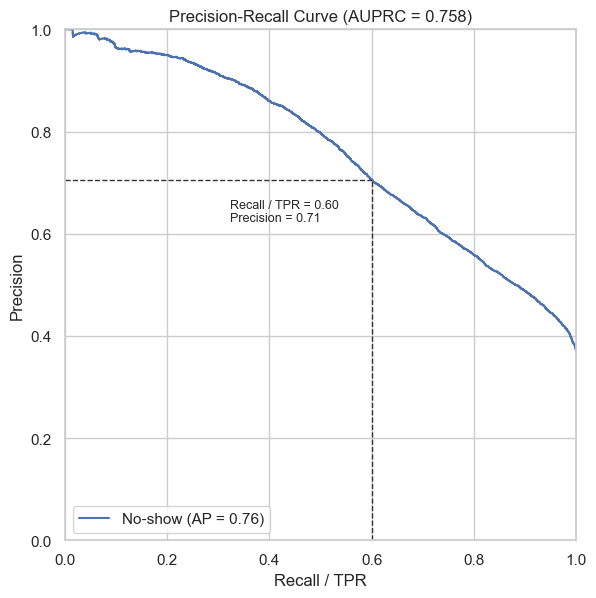
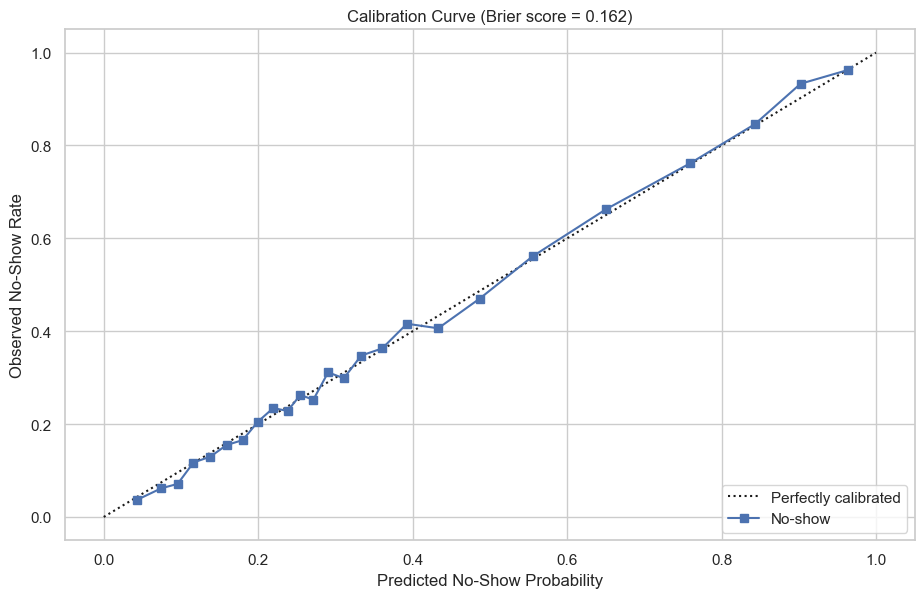

# Hotel No Show Prediction

<p align="center">
  
</p>

<p align="center">
  <sub>Header image source: <a href="https://www.prostay.com/blog/hotel-no-show/">Prostay, Hotel No Show: Prevention and Management Strategies</a>.</sub>
</p>

## 1. Project Objective

In this project, we leverage machine learning to accurately predict the probability that a hotel guest will show up for their booked stay ('0'), or if a no-show will occur ('1').

These probabilistic predictions are valuable as they can help inform hotel operations decisions, such as staffing, inventory management, reminder campaigns, deposit policies, and overbooking limits, so as to optimize business objectives such as profit.

## 2. Workflow Stages

To achieve the project objective, a machine learning workflow consisting of the following stages was developed, starting with the dataset noshow.db:

`noshow.db -> data ingestion -> data cleaning and validation -> feature engineering -> train/test split -> ML experiment -> pipeline selection and calibration -> holdout evaluation and results`

Note: a scikit-learn pipeline is composed of a preprocessor, which feeds engineered and preprocessed features to a machine learning model with specific hyperparameters to make a prediction.

<p align="center">
  <a href="https://weifengsiew.github.io/Hotel-No-Show-Prediction/?types=nodes&expandAllPipelines=false&pid=__default__">
    <strong>Visualise the workflow stages in detail</strong>
  </a>
</p>

## 3. Python Frameworks

This project is supported by the following Python frameworks:

<p align="center">
  
  
  
  
  
  
  
  
  
  
  
  
</p>

|  | Python framework used |
| --- | --- |
| Pipeline scaffolding | Kedro |
| Pipeline visualisation | Kedro-Viz |
| Data ingestion | pandas |
| Data cleaning | pandas |
| Data validation | Great Expectations, pandas |
| Feature engineering | pandas, NumPy |
| Train/test split | scikit-learn |
| ML experiment | scikit-learn, LightGBM, XGBoost |
| Experiment logging | MLflow |
| Pipeline selection and calibration | scikit-learn |
| Holdout evaluation and results | scikit-learn, Matplotlib, Seaborn, Jupyter |
| Pipeline persistence | joblib |

## 4. Results Summary

### Final Pipeline

Multiple candidate pipelines were compared during the ML experiment stage. The best candidate pipeline was selected based on the highest mean cross-validated AUROC, then calibrated on the train set (80%) using isotonic regression.

| Components of final pipeline | Details |
| --- | --- |
| Preprocessor | `preprocessor_v1` |
| Model | `LGBMClassifier` |
| Hyperparameters | `learning_rate=0.05`, `min_child_samples=20`, `n_estimators=300`, `num_leaves=127`, `class_weight="balanced"` |
| Calibration | Isotonic regression |

See [`notebooks/final_results.ipynb`](notebooks/final_results.ipynb) for multiple candidate pipelines compared.

### Final Results

The calibrated pipeline was evaluated on the test set (20%).

<p align="center">
  
  
</p>

<p align="center">
  
</p>

See [`notebooks/final_results.ipynb`](notebooks/final_results.ipynb) for the full results.

## 5. To Reproduce

### Clone Repository

```bash
git clone https://github.com/weifengsiew/Hotel-No-Show-Prediction.git
cd Hotel-No-Show-Prediction
```

### Environment Setup

Use Python 3.12.

```bash
python3.12 -m venv .venv
source .venv/bin/activate

python -m pip install --upgrade pip
python -m pip install -r requirements.txt
```

On macOS, install the OpenMP runtime required by LightGBM:

```bash
brew install libomp
```

### Run Workflow

Run the full workflow:

```bash
./run.sh
```

Open [`notebooks/final_results.ipynb`](notebooks/final_results.ipynb) for the final report.

Run stages individually:

```bash
./scripts/stage1.sh
./scripts/stage2.sh
./scripts/stage3.sh
./scripts/stage4.sh
```

| Script | Runs |
| --- | --- |
| `scripts/stage1.sh` | Download `noshow.db` |
| `scripts/stage2.sh` | `data ingestion -> data cleaning and validation` |
| `scripts/stage3.sh` | `feature engineering` |
| `scripts/stage4.sh` | `train/test split -> ML experiment -> pipeline selection and calibration -> holdout evaluation and results` |
| `scripts/all_stages.sh` | Runs stages 1-4 |

## 6. To Configure a New ML Experiment

To add a new candidate pipeline:

1. Add a new preprocessor builder in [`preprocessor_registry.py`](src/hotel_no_show_prediction/sklearn_pipeline_components/preprocessor_registry.py).
2. Add a new model in [`model_registry.py`](src/hotel_no_show_prediction/sklearn_pipeline_components/model_registry.py).
3. Add model hyperparameter search grids in [`conf/base/parameters/model_hyperparams/`](conf/base/parameters/model_hyperparams/).
4. Add the candidate name, preprocessor type, and model key in [`ml_experiment.yml`](conf/base/parameters/ml_experiment.yml).

## 7. Repository Structure

```text
.
|-- conf/
|   `-- base/
|       |-- catalog/              # Maps pipeline inputs/outputs to files
|       `-- parameters/          
|           |-- ml_experiment.yml  # Ml experiment configuration
|           `-- model_hyperparams/ # Hyperparameter search grids for Random Forest, LightGBM, and XGBoost
|-- data/
|   |-- raw/                      # Downloaded noshow.db dataset
|   |-- intermediate/             # Cleaned dataset
|   `-- processed/                # Feature-engineered dataset
|-- notebooks/
|   |-- final_results.ipynb       # Presentation of results
|   |-- final_results_helpers.py
|   `-- images/
|-- results/
|   |-- ml_experiments/           # best_model.joblib, test metrics, and persisted pipeline summary
|   |-- mlruns/                   # MLflow run params, metrics, tags, and artifacts
|   `-- validation/               # Data validation results
|-- scripts/
|   |-- all_stages.sh
|   |-- stage1.sh                 # download noshow.db
|   |-- stage2.sh                 # data ingestion -> data cleaning and validation
|   |-- stage3.sh                 # feature engineering
|   `-- stage4.sh                 # train/test split -> ML experiment -> pipeline selection and calibration -> holdout evaluation and results
|-- src/
|   `-- hotel_no_show_prediction/
|       |-- pipelines/            # Kedro nodes and pipelines for each workflow stage
|       `-- sklearn_pipeline_components/ # Preprocessor/model registries and config loaders
|-- pyproject.toml
|-- requirements.txt
`-- run.sh                        # Full workflow 
```
