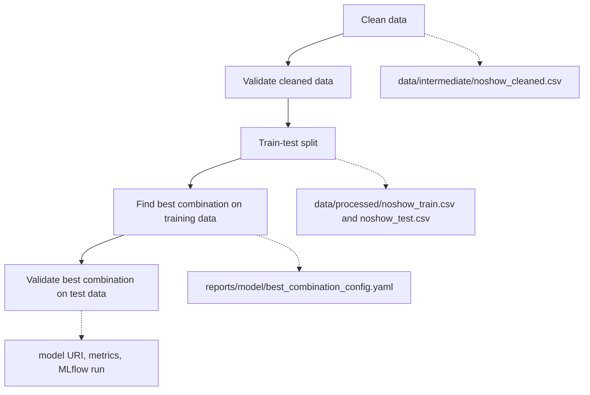

# Hotel No Show Prediction

**Name:** Siew Wei Feng  
**Email:** siewwf371@gmail.com

## Project Overview

This project builds a reproducible machine learning pipeline for predicting whether a hotel booking will result in a no-show. The pipeline is designed as a sequence of clear stages: extract raw booking data, transform and validate it, split train/test data, compare feature-model-hyperparameter combinations, evaluate the selected model once, and track the selected model with MLflow.

The main design decision is to separate workflow steps and configuration while using established libraries for the standard machine learning work. Data paths, processing choices, training settings, model hyperparameters, and experiment recipes are stored as YAML files under `configs/`, while scikit-learn handles splitting, preprocessing pipelines, and grid search.

## Folder Structure

```text
Hotel No Show Prediction/
├── configs/
│   ├── shared.yaml
│   ├── experiment_matrix.yaml
│   ├── features1.yaml
│   ├── features2.yaml
│   ├── random_forest.yaml
│   └── xgboost.yaml
├── data/
│   ├── raw/
│   │   └── noshow.db
│   ├── intermediate/
│   │   └── noshow_cleaned.csv
│   └── processed/
│       ├── noshow_train.csv
│       └── noshow_test.csv
├── notebooks/
│   └── xgboost_noshow_model.ipynb
├── reports/
│   ├── model/
│   │   └── best_combination_config.yaml
├── scripts/
│   ├── clean_data.py
│   ├── find_best_combination.py
│   ├── run_etl.py
│   ├── run_validation.py
│   ├── split_train_test.py
│   ├── validate_best_combination.py
│   └── validate_cleaned_data.py
├── src/
│   ├── config.py
│   ├── extraction.py
│   ├── loading.py
│   ├── model_pipeline.py
│   ├── transformation.py
│   └── validation.py
├── requirements.txt
├── run.sh
└── README.md
```

Key folders:

| Path | Purpose |
| --- | --- |
| `configs/` | Stores experiment configuration files. |
| `data/raw/` | Stores the original SQLite database. |
| `data/intermediate/` | Stores cleaned data from the ETL stage. |
| `data/processed/` | Stores train/test splits. |
| `notebooks/` | Stores exploratory model development notebooks. |
| `reports/model/` | Stores the selected config needed to validate the best combination. |
| `scripts/` | Stores one command-line entry point for each pipeline workflow step. |
| `src/` | Stores reusable extraction, transformation, validation, loading, config, and model-pipeline glue code. |

## Setup

This project uses a pip virtual environment. PySpark also requires Java 17.

On macOS with Homebrew:

```bash
brew install openjdk@17
```

Create and activate the virtual environment:

```bash
python3.11 -m venv noshowenv
source noshowenv/bin/activate
pip install -r requirements.txt
```

## Running the Pipeline

Run the data pipeline:

```bash
bash run.sh
```

This runs ETL first, then validates the cleaned data.

To run the two stages separately:

```bash
python scripts/clean_data.py
python scripts/validate_cleaned_data.py
```

The ETL stage extracts raw data from `data/raw/noshow.db`, transforms it, and saves the cleaned output to:

```text
data/intermediate/noshow_cleaned.csv
```

Split the cleaned data into train and test sets:

```bash
python scripts/split_train_test.py --config configs/shared.yaml
```

Find the best feature-model combination using cross-validation on the training set:

```bash
python scripts/find_best_combination.py --config configs/experiment_matrix.yaml
```

Validate the selected best combination on the untouched test set:

```bash
python scripts/validate_best_combination.py --config reports/model/best_combination_config.yaml
```

The model selection step compares these feature-model combinations:

| Feature recipe | Model |
| --- | --- |
| `features1.yaml` | XGBoost |
| `features1.yaml` | Random forest |
| `features2.yaml` | XGBoost |
| `features2.yaml` | Random forest |

This saves:

| Output | Path |
| --- | --- |
| Training split | `data/processed/noshow_train.csv` |
| Test split | `data/processed/noshow_test.csv` |
| Best combination config | `reports/model/best_combination_config.yaml` |
| MLflow tracking database | `mlflow.db` |
| MLflow run artifacts | `mlruns/` |

## Modifying Parameters

Most experiment settings are controlled through config files:

```text
configs/shared.yaml
configs/features1.yaml
configs/features2.yaml
configs/xgboost.yaml
configs/random_forest.yaml
configs/experiment_matrix.yaml
```

The shared settings are separated by concern:

| Config file | What it controls |
| --- | --- |
| `configs/shared.yaml` | Dataset paths, target column, dropped columns, train/test split, random seed, scoring metric, cross-validation folds, and grid search settings. |
| `configs/features1.yaml` | Feature processing with categorical imputation, numeric imputation, and one-hot encoding. |
| `configs/features2.yaml` | Feature processing with categorical imputation, numeric imputation, and ordinal encoding. |
| `configs/xgboost.yaml` | XGBoost model parameters and tuning grid. |
| `configs/random_forest.yaml` | Random forest model parameters and tuning grid. |
| `configs/experiment_matrix.yaml` | Scalable experiment matrix that combines every listed feature recipe with every listed model recipe. |

The matrix config lists reusable feature and model configs:

```yaml
shared_config: configs/shared.yaml

features:
  features1:
    config: configs/features1.yaml
  features2:
    config: configs/features2.yaml

models:
  xgboost:
    config: configs/xgboost.yaml
  random_forest:
    config: configs/random_forest.yaml
```

`scripts/find_best_combination.py` uses scikit-learn `Pipeline`, `ColumnTransformer`, and `GridSearchCV` to search feature recipes, model types, and hyperparameters together. This keeps imputation and categorical encoding inside cross-validation folds. `scripts/validate_best_combination.py` evaluates only the selected best combination on the untouched test set and records metrics, model artifacts, and the model URI through MLflow.

Important sections:

| Config section | What it controls |
| --- | --- |
| `data` | Input/output paths, target column, and dropped columns. |
| `processing` | Imputation strategies and categorical encoding. |
| `training` | Test size, random seed, scoring metric, cross-validation folds, and grid search parallelism. |
| `model` | Model algorithm, base model parameters, and tuning grid. |
| `tracking` | MLflow experiment name, run name, and tracking URI. |
| `outputs` | Model and report output paths. |

Example: to try a larger XGBoost search, create a new file such as `configs/xgboost_large_grid.yaml` and edit `model.tuning_grid`:

```yaml
model:
  tuning_grid:
    n_estimators: [150, 300, 500]
    max_depth: [3, 4, 5]
    learning_rate: [0.03, 0.05, 0.1]
```

Example: to optimize experiments for recall instead of ROC AUC, edit `configs/shared.yaml`:

```yaml
training:
  scoring: recall
```

The experimentation script supports multiple algorithms through the model configs. The random forest config uses:

```yaml
model:
  name: random_forest
```

## Pipeline Flow



The workflow maps to scripts, source modules, and library tools as follows:

| Workflow step | What it means | Script user runs | Logic and libraries used |
| --- | --- | --- | --- |
| Clean data | Extract raw records, transform columns, handle missing values, parse price fields, and save cleaned data. | `scripts/clean_data.py` | `src/extraction.py`: reads raw SQLite data. `src/transformation.py`: cleans and transforms columns. `src/loading.py`: saves cleaned CSV. |
| Validate cleaned data | Check schema, null rules, ranges, and categories before modeling. | `scripts/validate_cleaned_data.py` | `src/validation.py`: defines and runs data quality checks. |
| Train-test split | Split cleaned data into training data and untouched test data. | `scripts/split_train_test.py` | Uses `sklearn.model_selection.train_test_split` and saves train/test CSV files. |
| Find best combination on training data | Use training data only to compare feature recipes, model types, and hyperparameters with cross-validation. | `scripts/find_best_combination.py` | Uses `src/model_pipeline.py` to create scikit-learn preprocessors and model objects, then uses `GridSearchCV` to search preprocessing recipe, model type, and hyperparameters together. |
| Validate best combination on test data | Fit the selected pipeline on training data, evaluate once on the untouched test set, and store the selected MLflow model URI. | `scripts/validate_best_combination.py` | Uses `src/model_pipeline.py` for preprocessing/model construction, MLflow sklearn autologging for the fitted model, and `mlflow.models.evaluate` for final classifier evaluation. |

## Feature Processing

| Feature or feature group | Processing applied | Reason |
| --- | --- | --- |
| `booking_id` | Dropped before modeling. | Identifier column; not useful for generalizable prediction. |
| `no_show` | Used as target column. | Binary outcome to predict. |
| `branch` | Standardized as text, then encoded. | Converts hotel branch categories into numeric model inputs. |
| `booking_month` | Standardized as text, then encoded. | Captures seasonality in booking timing. |
| `arrival_month` | Standardized as text, then encoded. | Captures seasonality in arrival timing. |
| `arrival_day` | Converted to expected numeric type; median-imputed if needed. | Numeric calendar feature. |
| `checkout_month` | Standardized as text, then encoded. | Captures seasonality in checkout timing. |
| `checkout_day` | Converted to expected numeric type; median-imputed if needed. | Numeric calendar feature. |
| `country` | Standardized as text, then encoded. | Captures customer country information. |
| `first_time` | Standardized as text, then encoded. | Represents whether the guest is a first-time customer. |
| `room` | Missing values converted to `Null`, standardized, then encoded. | Keeps missing room information explicit instead of silently dropping it. |
| `price` | Standardized as text, used to create price fields, then dropped before modeling. | Raw string is replaced by structured model features. |
| `price_is_missing` | Created during transformation, then encoded. | Indicates whether original price information was missing. |
| `price_matches_expected_pattern` | Created during transformation, then encoded. | Indicates whether price followed the expected currency/amount format. |
| `price_currency` | Extracted from `price`, then encoded. | Captures currency information separately from amount. |
| `price_amount` | Extracted from `price`, converted to numeric, median-imputed if needed. | Numeric price signal for the model. |
| `platform` | Standardized as text, then encoded. | Captures booking channel. |
| `num_adults` | Converted to numeric; word values are converted to digits. | Numeric occupancy feature. |
| `num_children` | Converted to numeric. | Numeric occupancy feature. |

`features1.yaml` uses one-hot encoding, while `features2.yaml` uses ordinal encoding. The selected feature recipe is kept inside the fitted scikit-learn pipeline so the same preprocessing is applied during training, testing, and deployment.

## Model Choice

The project currently trains and evaluates two tree-based models: **XGBoost** and **random forest**.

XGBoost was chosen because:

- The dataset is tabular, and gradient-boosted trees usually perform well on tabular data.
- It can capture non-linear relationships between booking attributes and no-show behavior.
- It works well with one-hot encoded categorical variables and numeric variables.
- It provides feature importance values for model interpretation.
- It has tunable parameters such as number of trees, tree depth, learning rate, subsampling, and column sampling.

Random forest was added as a comparison model because:

- It is a strong, widely used baseline for tabular classification.
- It is less sensitive to hyperparameter choices than boosted trees.
- It helps test whether the extra complexity of boosting is necessary for this dataset.
- It can model non-linear relationships and feature interactions.

The pipeline is intentionally configurable so additional algorithms can be tested in the same pattern.

## Hyperparameter Tuning

The models are tuned using `GridSearchCV` with 5-fold cross-validation on the training set only. Each model keeps four high-value hyperparameters in the grid. To keep experimentation fast, only `n_estimators` currently has multiple values. The other hyperparameters are included as single-value lists so they can be expanded later.

The XGBoost tuning grid is:

| Parameter | Values tested |
| --- | --- |
| `n_estimators` | `300`, `500` |
| `max_depth` | `4` |
| `learning_rate` | `0.1` |
| `min_child_weight` | `1` |

The scoring metric used during tuning is `roc_auc`, because the task is a binary classification problem and ROC AUC evaluates the model's ability to rank no-show cases above non-no-show cases across thresholds.

Best XGBoost parameters from the current run:

```json
{
  "learning_rate": 0.1,
  "max_depth": 4,
  "n_estimators": 300,
  "min_child_weight": 1
}
```

The random forest tuning grid is:

| Parameter | Values tested |
| --- | --- |
| `n_estimators` | `300`, `500` |
| `max_depth` | `20` |
| `min_samples_leaf` | `1` |
| `max_features` | `sqrt` |

Best random forest parameters from the current run:

```json
{
  "max_depth": 20,
  "max_features": "sqrt",
  "min_samples_leaf": 1,
  "n_estimators": 500
}
```

## Model Evaluation

The selected model is evaluated once on a holdout test set containing 20% of the data. The split is stratified so the no-show rate is kept similar across train and test sets. Feature recipes, model types, and hyperparameters are selected using cross-validation on the remaining 80% training set.

Metrics used:

| Metric | Meaning |
| --- | --- |
| Accuracy | Overall proportion of correct predictions. |
| Balanced accuracy | Average of recall for each class; useful when classes are imbalanced. |
| Precision | Among predicted no-shows, the proportion that were truly no-shows. |
| Recall | Among actual no-shows, the proportion correctly detected. |
| F1 score | Harmonic mean of precision and recall. |
| ROC AUC | Measures how well the model ranks no-show cases above show cases across thresholds. |
| Average precision | Summarizes precision-recall performance, useful when positive cases are less common. |

Previous holdout performance before the final-selection refactor:

| Metric | XGBoost | Random forest |
| --- | ---: | ---: |
| Accuracy | 0.7447 | 0.7578 |
| Balanced accuracy | 0.7021 | 0.7160 |
| Precision | 0.7032 | 0.7267 |
| Recall | 0.5378 | 0.5547 |
| F1 score | 0.6095 | 0.6291 |
| ROC AUC | 0.7813 | 0.8053 |
| Average precision | 0.7000 | 0.7524 |

XGBoost confusion matrix:

|  | Predicted show | Predicted no-show |
| --- | ---: | ---: |
| Actual show | 13025 | 2008 |
| Actual no-show | 4088 | 4757 |

Random forest confusion matrix:

|  | Predicted show | Predicted no-show |
| --- | ---: | ---: |
| Actual show | 13188 | 1845 |
| Actual no-show | 3939 | 4906 |

Both models had reasonable ROC AUC values in the earlier run, suggesting they could rank higher-risk bookings above lower-risk bookings. Random forest performed better on that holdout split across ROC AUC, F1 score, recall, precision, and average precision. If the business priority is to catch more no-shows, the classification threshold or tuning metric could still be adjusted toward recall.

## Experiment Tracking

MLflow is used to track:

- model parameters
- best tuned parameters
- evaluation metrics
- generated reports
- trained model artifact
- config file used for the run

The tracking URI is configured in `configs/experiment_matrix.yaml`:

```yaml
tracking:
  tracking_uri: sqlite:///mlflow.db
```

To inspect experiments locally:

```bash
mlflow ui --backend-store-uri sqlite:///mlflow.db
```

Then open the URL printed by MLflow in your browser.
